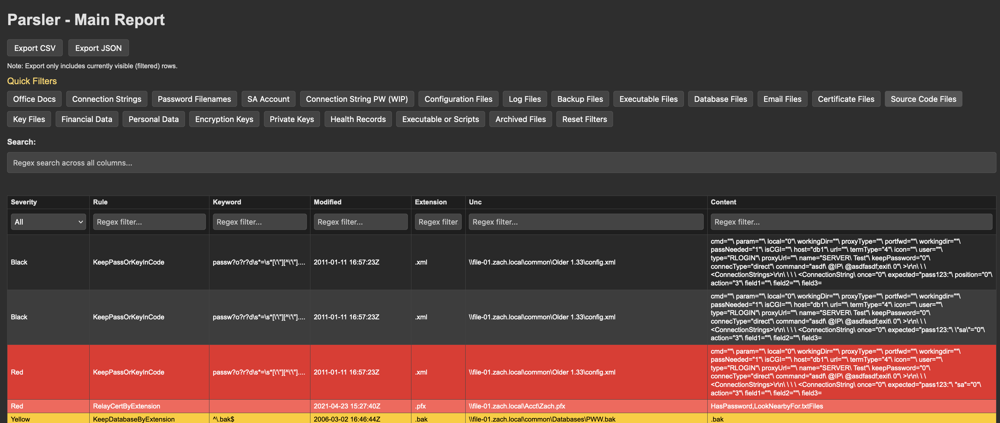
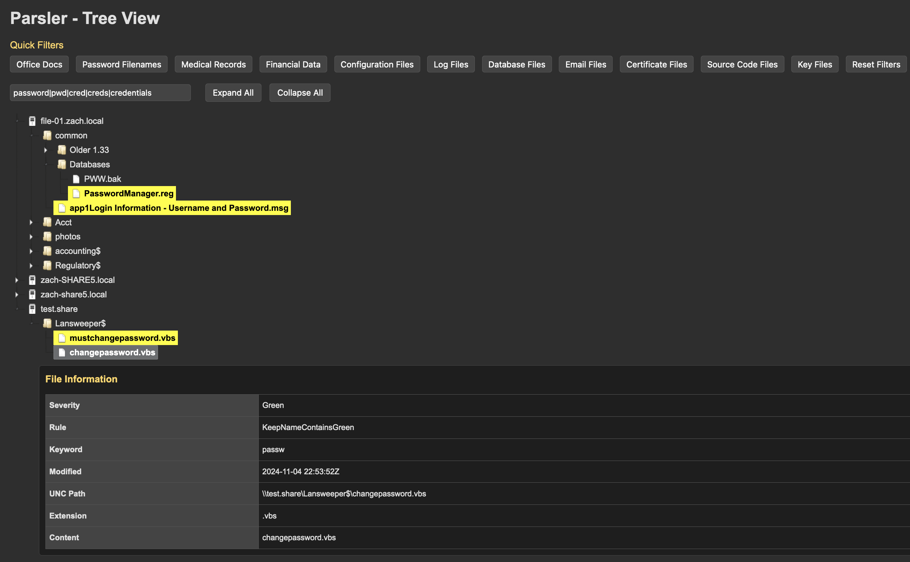
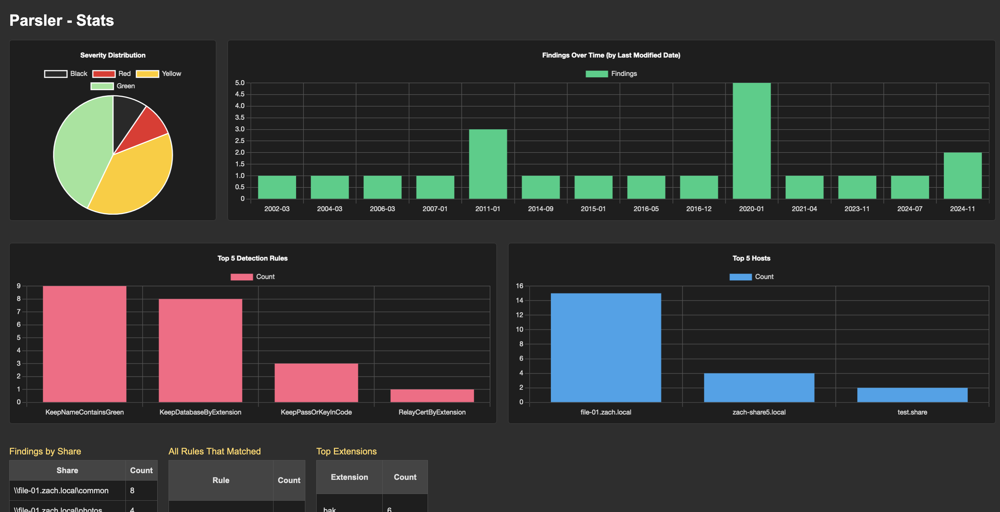
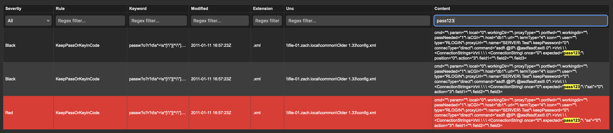

# Parsler

Welcome to **Parsler**, a tool designed to streamline the review process for the output generated by Snaffler. Sifting through extensive logs can be overwhelming, and this tool helps organize the data into a more manageable format.


## Why Does This Exist?

While Snaffler is excellent at identifying files and potential risks, its raw output can be challenging to review effectively. Parsler organizes this data, making it easier to locate and address sensitive files efficiently.


## What Does It Do?

This tool generates **four structured pages** to help you analyze Snaffler's output effectively:

### Main Report

- A comprehensive tabular view of every finding.
- Features include:
  - **Search:** Use keywords or regular expressions to locate specific results.
  - **Filters:** Refine results by severity, file type, or other attributes.
  - **Sorting:** Organize data by attributes such as severity or modification date.
  - **Export Options:** Save filtered results as CSV or JSON for further analysis or reporting.



### Tree View

- A hierarchical representation of findings, ideal for understanding the structure of file shares.
- Features include:
  - **Expandable Folders:** Navigate through directories by expanding and collapsing folders.
  - **Quick Filters:** Highlight files based on specific types, such as `.pem` or `password` files.
  - **Inline Details:** View additional details of a file directly below it upon selection.
  - **Search:** Locate matching files or folders using keywords or regular expressions.



### Dashboard

- Visual analytics provide insights into the findings at a glance.
- Features include:
  - **Severity Distribution:** A pie chart showing the proportion of files by severity level.
  - **Top Rules:** A bar chart displaying the most frequently matched rules.
  - **Host Analysis:** Insights into the servers with the most flagged files.
  - **File Age Trends:** A timeline of file modifications to identify patterns.



### Help Page

- A resource for understanding the tool and findings.
- Features include:
  - Practical guidance for reviewing results.
  - Detailed explanations of the pages and their features.
  - Tips for interpreting findings and reducing false positives.


## How to Use It

1. **Run Snaffler:** Generate the output file.
    ```
    Snaffler.exe -y -s -o snaffler.log
    ```

2. **Feed It to Parsler:** The tool will create the HTML pages for you.
    ```
    python3 snaffler.py -in snaffler.log
    ```

3. **Open the Pages:** Use your browser to navigate through the generated pages.

4. **Start Reviewing:** Use the filters, search, and visualizations to identify and prioritize findings effectively.




## Why Should You Care?

Effectively reviewing the output from Snaffler is crucial for identifying and mitigating security risks, such as:

- Files containing sensitive information, such as `passwords.docx`, which may expose your organization to potential breaches.
- Misplaced `.pem` keys or configuration files that could lead to unauthorized access to servers or systems.
- Database connection strings or other credentials stored in accessible locations.

Addressing these risks promptly helps strengthen your organization’s security posture and prevents potential data breaches. Parsler simplifies this process, enabling a more efficient and accurate review.


